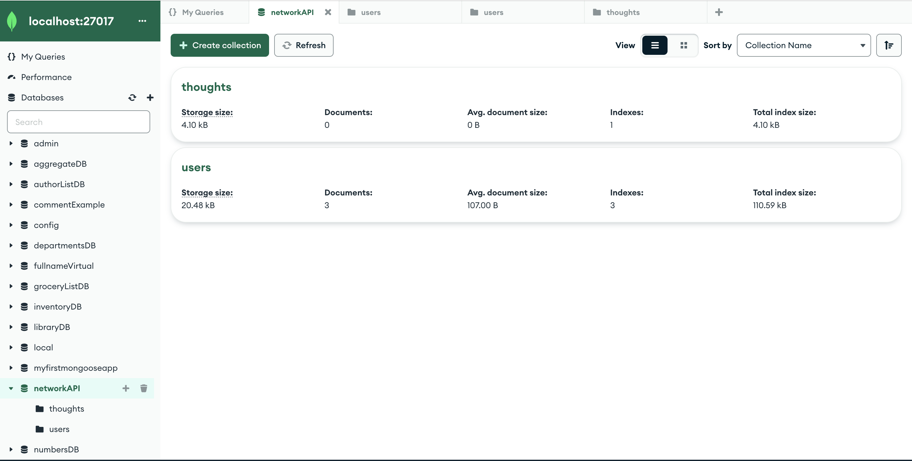
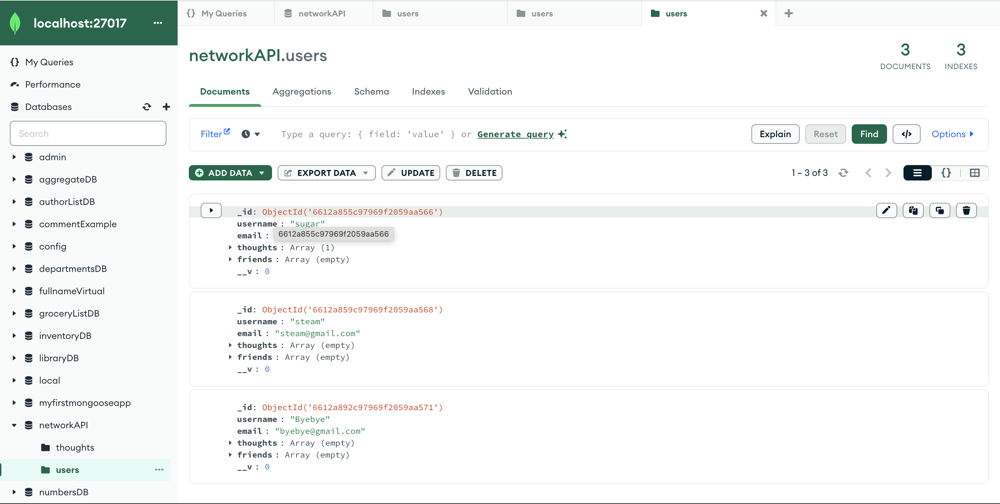

  
<h1 align="center">Social Network API </h1>

  
  
  
 

  
  
  
  
  

## Description 📚

- What was your motivation? Why did you build this project? What problem does it solve? What did you learn?

This project has been built to utilize and organize large amounts of data using MongoDB. The project will build a structure of an API for a social network where users can share their thoughts, ract to friends' thoughts, and create a friend list. 

This was created using HTML,CSS,Javascript,NodeJS.

## Table of Contents 

- [User-Story](#user-story)
- [Acceptance-Criteria](#acceptance-criteria)
- [Installation](#installation-📋)
- [Usage](#usage-🏁)
- [Demonstration](#demonstration)
- [Author](#author-👋🏽)

## User Story

AS A social media startup
I WANT an API for my social network that uses a NoSQL database
SO THAT my website can handle large amounts of unstructured data

## Acceptance Criteria

GIVEN a social network API"

- WHEN I enter the command to invoke the application THEN my server is started and the Mongoose models are synced to the MongoDB database
- WHEN I open API GET routes in Insomnia for users and thoughts THEN the data for each of these routes is displayed in a formatted JSON
- WHEN I test API POST, PUT, and DELETE routes in Insomnia THEN I am able to successfully create, update, and delete users and thoughts in my database
- WHEN I test API POST and DELETE routes in Insomnia THEN I am able to successfully create and delete reactions to thoughts and add and remove friends to a user’s friend list

## Installation 📋

- What are the steps required to install your project? Provide a step-by-step description of how to get the development environment running.

`npm i` will install the necessary dependancies. In this case, the dependancies are express, mongoode and nodemon. 

Once everything has been installed, the user can open an integrated terminanl and run `npm run start` to connect to MongoDB and connect to the local server at 3002.

## Usage 🏁

Thise database integrates different schemas and models to manipulate data. The networkAPI database hold Thoughts and Users which interact with each other through User thoughts and reactions, logging user friends as well as deleting and removing thoughts, reactions, friends and users. 

## Demonstration

You can find a demonstration on YouTube [here](https://youtu.be/P03SS7KCsxE). This show all the routes being utilized and the data being manipulated to fit the acceptance criteria.

MongoDB was utilized for the database. Mongo makes storing data and organizing the data clear and clean. The database is named networkAPI and it has Thought and User. The data is held within those schemas and can interact as picture below. 

  

## Author 👋🏽

GitHub Username: [schneidsmc](https://github.com/schneidsmc)

📧 Email: schneidsmc@gmail.com

This README was created with ❤️ using README Generator 👏🏽👏🏽

